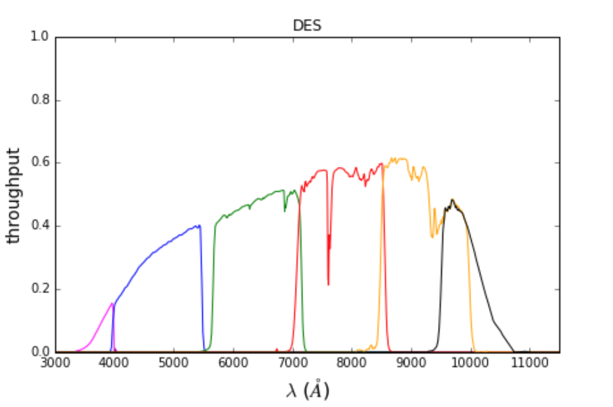
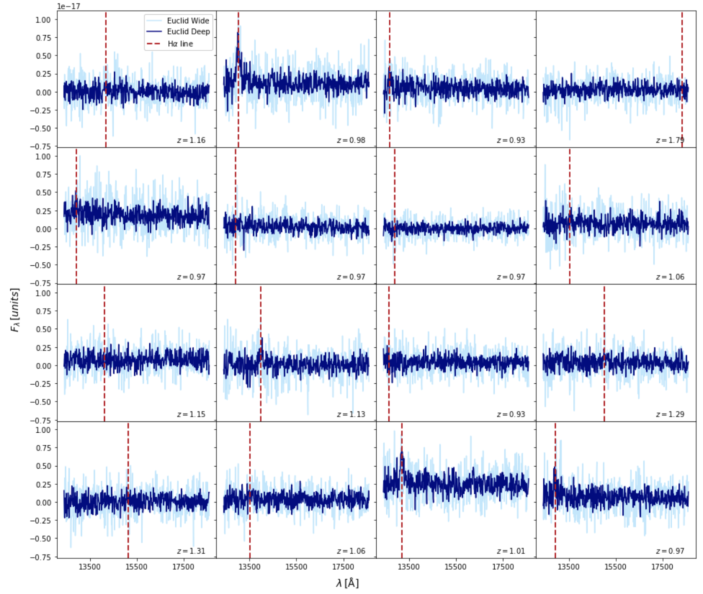
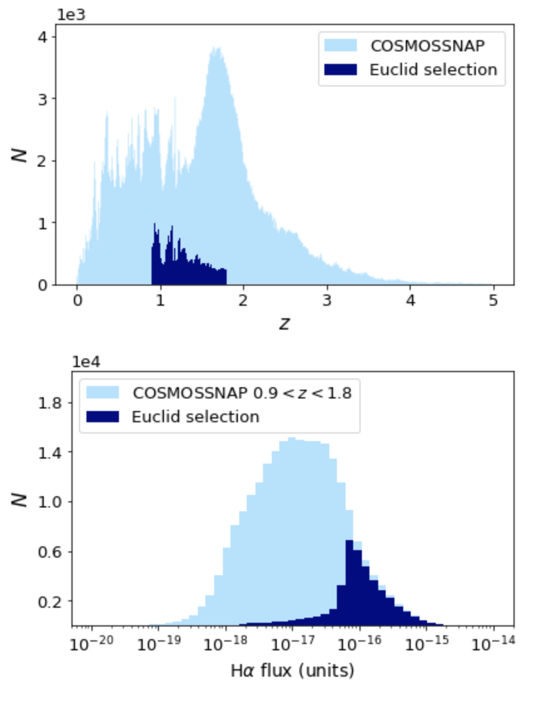

# Application to Euclid data: spectroscopic and photometric galaxy simulations

This repository contains a suite of tools to link astrophysical simulation codes, which are combined in a pipeline to generate galaxy photometry and spectroscopy representative of the expected quality of the Euclid Mission data. This simulated data set can be used to help develop and benchmark spectroscopic and photometric redshift estimation methods, and to assess whether their redshift accuracy meets the official Mission Requirements for successful cosmological measurements.

<!---
The software available in the repository includes:
   - List the functionality here
   - bla 1
   - bla 2
--->

> Corresponding Author: **Bruno Moraes (University College London)**, [b.moraes@ucl.ac.uk](mailto:b.moraes@ucl.ac.uk)
>

## Table of Contents
1. [Introduction](#intro)
    * [Dark Energy and the Euclid satellite](#science)
    * [Spectroscopic and photometric redshifts](#specphot)
    * [Simulations need](#need4sims)
    <!--- * [The structure](#struct) --->
2. [Requirements](#requirements)
    * [Basic Python dependencies](#basic)
    * [COSMOSSNAP](#cosmossnap)
    * [TIPS](#tips)
    * [ISAP](#isap)
    * [A PBS cluster](#pbscluster)
3. [Getting Started](#start)
4. [Example: Realistic Euclid spectroscopic data set creation](#example)
    * [Generating a galaxy catalog and their clean spectra with COSMOSSNAP](#step1)
    * [Transforming spectra to TIPS input format](#step2)
    * [Generating realistic Euclid noisy spectra with TIPS](#step3)
    * [Postprocessing and sample selection for final catalog](#step4)

---

## <a name="intro"></a> 1. Introduction

### <a name="science"></a> Dark Energy and the Euclid Satellite

The European Space Agency [Euclid Mission](http://sci.esa.int/euclid) aims to measure the global properties of the Universe to unprecedented accuracy, with particular emphasis on the properties of the mysterious Dark Energy that is driving the acceleration of the expansion of the Universe. These properties can be inferred from the statistical distribution of galaxies in the Universe and from the effects of the matter distribution on their observed shapes through gravitational lensing. However, this requires extreme precision and accuracy on shape and positional measurements of galaxies.

In particular, measuring their radial distances from us is one of the most challenging problems in modern observational cosmology. The way we infer those distances is through the Doppler effect: due to the expansion of the Cosmos, galaxies are receding from us and their light is consequently shifted towards longer wavelengths (the "red" side of the electromagnetic spectrum). This _redshift_ is directly related to a galaxy's distance, and by measuring it from the properties of the received light, we can reconstruct its position.

### <a name="specphot"></a> Spectroscopic and photometric redshifts

In astronomy, there are two main methods for measuring galaxy redshifts. Measuring _spectroscopic redshifts_ consists in observing the full spectral energy distribution (SED) of a galaxy and identifying features that allow a secure redshift determination. A galaxy's spectrum is a consequence of a series of relatively well-understood physical phenomena, mostly concerning the nuclear and chemical reactions inside stars and the types and ages of stellar populations within the galaxy in question. Atomic emission and absorption lines give rise to very distinct peaks and troughs in a galaxy SED. By identifying such a feature, its wavelength can be compared to the known wavelength of such a transition observed in Earth’s laboratories, and this yields the value of the redshift by the cosmological Doppler effect.

_Photometric redshift_ measurements, on the other hand, try to reconstruct the redshift value from only a handful of numbers representing the integrated light flux in broadband filters. Degeneracies abound, making results less precise and possibly biased, but they circumvent the need of a spectrograph and can also reach fainter magnitudes, as light is integrated in broad wavelength ranges. Robust photometric redshifts depend much more on a correct model for spectral templates and understanding of the global properties and types of galaxies, and less on the detection of specific features.


### <a name="need4sims"></a> Simulation needs

<!---__ADD PARAGRAPH HERE AS TO WHY SIMULATIONS ARE IMPORTANT__--->

When generating a large realistic simulated spectroscopic and photometric data set to be used as a test bed for redshift estimation, we need to ensure that it is representative of the expected quality of Euclid data. Another requirement is to have a realistic distribution of galaxies in several photometric observational parameters. We want our simulated data to follow representative redshift, color, magnitude and spectral type distributions. These quantities depend on each other in intricate ways; correctly capturing the correlations is essential if we want to have a realistic assessment of the accuracy and improvements of our proposed methods.

We also require realistic spectral energy distributions (SEDs) and emission-line strengths. Euclid will observe an estimated 50 million spectra through slitless spectroscopy. The required sensitivity is defined in terms of the significance of the detection of the Hα Balmer transition line. These requirements imply a detection rate that depends on magnitude and redshift, therefore demanding that we simulated realistic Hα line width and strength, which depend on the properties of the continuum of the spectral distribution. In addition to continuum and line properties, extinction of light by dust within each galaxy needs to be simulated.

<!---
Need a few more paragraphs here describing the noise we want to add for photometry and the different flavours of spectroscopy. Here or on the Example?
--->

## <a name="requirements"></a> 2. Requirements

### <a name="basic"></a> Basic Python dependencies

All necessary Python dependencies are included in the Anaconda distribution. The code is compatible with Python 2 and 3.

### <a name="cosmossnap"></a> COSMOSSNAP
COSMOSSNAP is a FORTRAN 77 package to generate spectrophotometric simulations based on real data from the Hubble Telescope [COSMOS survey](http://cosmos.astro.caltech.edu/). It uses galaxy properties catalogs from COSMOS observations, combined with many follow-up ground observations, to generate a synthetic catalog reproducing the relevant observational properties, whilst associating a "true" consistent redshift and SED to each galaxy. Details are described in [Jouvel et al. (2009)](https://arxiv.org/abs/0902.0625).

Previous public links to COSMOSSNAP are deprecated. To obtain a copy of the software and installation instructions, please contact the Corresponding Author.

### <a name="tips"></a> TIPS

TIPS is a software package designed to perform simulations of astronomical slitless spectroscopy observations. It is the pixel simulator of the NISP slitless spectrograph of the ESA Euclid space mission (http://sci.esa.int/euclid). It is based on the aXeSIM code, which is part of the aXe sofware package developed for the support of the Hubble Space Telescope slitless spectroscopic observation modes. 

To install TIPS, clone and follow instructions from https://gitlab.in2p3.fr/in2p3_euclid/tips

### <a name="isap"></a> ISAP
ISAP (Interactive Sparse Astronomical Data Analysis Packages) is a collection of packages in IDL and C++ related to sparsity and its application in astronomical data analysis. You will only need it if you intend to estimate spectroscopic redshifts or denoise galaxy spectra. Instructions for downloading and installing ISAP can be found on its [main webpage](http://www.cosmostat.org/software/isap).

_You will also need an IDL installation and license for this functionality to work. [IDL](http://www.idl-envi.com) is a numerical analysis software analogous to Matlab and is often used in astrophysics, especially in legacy code._


### <a name="pbscluster"></a> A PBS cluster

You will definitely need a computational cluster if you intend to run COSMOSSNAP or TIPS on a non-trivial amount of data. This repository provides PBS scripts to run the different steps of the data processing in such a setting. These were tested in a cluster using the C Shell ([I know, sorry...](http://www.shlomifish.org/open-source/anti/csh/)), so you will need to adapt some lines to Bash if that's what your system uses. This should be easy to do if you have moderate experience with shell scripting.

## <a name="start"></a> 3. Getting Started

To use the functionality developed in this repository, simply clone it into your preferred location and ensure that your system's PYTHONPATH points to it. Setting paths for the [Requirements](#requirements) will be necessary only for the specific functionality you intend to use.

All calls to data in any of the examples refer to the relative location a 'data' folder. To set this up, create an empty 'data' folder in ./dedale_d51/, download this [tarball](add_link_here) (for example, with wget) and untar it within the data folder. __BEWARE: This currently contains several GBs of data.__ This alternative [tarball](add_link_here) contains only the data needed to run the example below. For alternative ways to distribute the full data set, contact the Corresponding Author.

## <a name="example"></a> 4. Example: Euclid-like spectroscopic data

In this example, we demonstrate the use of most of the functionality included in the repository. There are 4 main steps:

    1. Run COSMOSSNAP to generate a simulated galaxy catalog with broadband photometry and their associated clean SEDs.
    2. Run TIPS on the galaxy spectra to obtain realistic Euclid-like noisy SEDs.
    3. Select the galaxy population that will be detected by Euclid slitless spectroscopy.
    4. Run Darth Fader on the resulting spectra to measure redshifts.

Steps 1, 2 and 4 require the use of a computational cluster. In-between these steps, a non-trivial amount of data processing and formatting is required, which is part of the functionality provided in this repository. These intermediate steps are also described in this Example.

### <a name="step1"></a> Generating a galaxy catalog and their clean spectra with COSMOSSNAP

To run COSMOSSNAP, you need to define a configuration file and an error file. You can find the ones used in this example [here](add_link_here)

To launch the code in batch runs in a PBS cluster, the command is:

```bash
$ python example/qsub_batch_cosmossnap.py
```

This python script generates multiple PBS files for batches of the base data. The generic form of the COSMOSSNAP command is:

```bash
$ $COSMOSSNAPDIR/source/cosmossnap -c /path/to/config.para -SNAP_OUT /path/to/outfile.out -STAR [YES/NO] -AGN [YES/NO] -SPECTRA_OUT /path/to/spectra.fits -SPECTRA_LAMBDA Lmin,Lmax,dL -LINES_STARTEND min,max
```
where

- __'-c'__ is the path to the configuration file. Error configurations and broadband filters are defined there. If you want to add filters, copy the files in the appropriate format to COSMOSSNAP/filt/.
- __'-SNAP_OUT'__ is the path to the output photometric subcatalogs.
- __'-STAR'__ indicates whether stars are excluded from the catalog.
- __'-AGN'__ indicates whether Active Galactic Nuclei (AGNs) are excluded from the catalog.
- __'-SPECTRA_OUT'__ produces FITS files with the corresponding spectra, and saves them to the path given.
- __'-SPECTRA_LAMBDA'__ defines the wavelength range and resolution.
- __'-LINES_STARTEND'__ runs the code on a subselection of the base catalog between the lines given. There is no randomness in the sampling of the catalog, i.e. a given entry number will always correspond to the same galaxy.


For more detail on how to run COSMOSSNAP and what it produces, please look at COSMOSSNAP's README. For information purposes, we include a copy [here](add_link_here).

<!---__ADD A SHORT EXPLANATION OF WHAT COSMOSSNAP IS DOING AND MAYBE A FIGURE OF RESULTS__--->

<!---
#### What exactly is COSMOSSNAP doing?

To generate realistic photometric properties, the first step is to integrate the best-fit spectral template through a set of broadband wavelength filters that will be used for a given galaxy survey. In actuality, the full transmission curve includes not only filter effects, but also atmospheric transmission (in the case of ground observations), telescope optical effects and more. The full transmission curve is commonly referred to as filter throughput (even though it is not only due to the filter itself). Euclid will require assistance from ground-based survey data sets in order to measure accurate photometric redshifts. COSMOSSNAP takes a defined set of filter throughput definitions for any given ground-based galaxy survey and calculates magnitudes for each galaxy in the catalogue.

<figure style="float: right; padding-bottom:0.5em;">

<figcaption style="width:350; font-size:80%; text-align:justify;">Optical broadband filters designed for the Dark Energy Survey, covering the range from the ultraviolet to the near-infrared. COSMOSSNAP simulates the integration of galaxy SEDs through a given set of filters, including multiple sources of experimental noise. </figcaption>
</figure>

Optical broadband observations are also subject to noise. The two main sources of noise are caused by finite photon counts and CCD read-out noise. These are also introduced by COSMOSSNAP. To verify that the photometric simulations are indeed realistic to the required level, we compare the DES magnitudes and magnitude errors to real data from the CFHT Stripe-82 Survey (CS82). The DES-like i filter data is simulated to have very similar quality to the true CS82 data. The distributions of magnitude errors and depth are in good agreement, confirming that the simulations are a faithful representation of realistic photometric data.
--->

### <a name="step2"></a>  Transforming spectra to TIPS input format

<!---__ADD A VERY SHORT EXPLANATION OF WHAT THE CODE IS DOING TO THE SPECTRA HERE__--->

It is necessary to reformat the files to the TIPS input format. For that we use a batch PBS creator written in python, which can be called as:

```bash
$ python example/qsub_batch_cosmossnap_to_tips.py
```

This is a simple script which, given a number of batches, creates a PBS script for each batch, launches it on a cluster node and deletes it on the fly. The PBS scripts call a python script that performs the necessary operations on the FITS files. The generic call is

```bash
python ../scripts/process_cosmossnap_to_tips.py ../data/cosmossnap/example_run_phot_%d.out ../data/cosmossnap/example_run_spec_%d.fits ../data/cosmossnap/output/
```

where %d are integers indicating the file in each PBS run. Bear in mind that the paths in the call are _relative_ paths.

### <a name="step3"></a> Generating spectra with TIPS

As mentioned in the requirements section, TIPS is a pixel simulator developed to provide simulated images of Euclid's NISP near-infrared slitless spectrometer. It has functionality to simulate full 2D images, with realistic astrophysical and detector effects. TIPS also provides functionality to directly output 1D spectra, bypassing some of the time-consuming steps of generating the full images. This simplification is still realistic enough for most interesting applications. Here, we focus on this latter use case. For more details on the full image simulator, consult [Zoubian et al. (2014)](http://adsabs.harvard.edu/abs/2014ASPC..485..509Z) and [this example](https://projets.lam.fr/projects/tips/wiki/Examples).

To run TIPS, we use a PBS launcher to run batches of jobs with a predefined number of spectra:

```bash
$ qsub example/qsub_launcher_tips_array.sh
```

This command will launch the python script [scripts/run_tips_on_block.py](add_link_here) on a single cluster node. This script spawns subprocesses to use the node's cores, and each subprocess calls the TIPS 1D spectrum simulation script:

```bash
$ python $TIPSDIR/tips/scripts/mk_spc_1d.py path_to_spc_file sigma_src number_exposure sky_background path_to_tips_conf working_directory
```

where

- __'path_to_spc_file'__ is the path to the spectroscopic input of a run, coming from COSMOSSNAP postprocessing.
- __'sigma_src'__ is the size of the simulated 2d galaxy image in arcseconds. We use 1.5" for all our simulations.
- __'number_exposure'__ is the number of images observed that compose the full integrated 2d image. We use 4 for 'Euclid Wide' and 20 for 'Euclid Deep'.
- __'sky_background'__ is the constant flux due to diffuse astrophysical sources such as [zodiacal light](https://en.wikipedia.org/wiki/Zodiacal_light)
- __'path_to_tips_conf'__ is the path to TIPS configuration file.
- __'working_directory'__ is the path where TIPS creates - several - intermediate files and folders.

During TIPS runs, [scripts/run_tips_on_block.py](add_link_here) saves the intermediate files in a local folder on the cluster node to minimize multiple transfers through the cluster network. The 1D spectra are saved to a local folder on the login node at the end of the full process.

For more details on TIPS outputs and options, check the documentation in the $TIPSDIR/tips/scripts/mk_spc_1d.py script.

<figure style="float: center; padding-bottom:0.5em;">

<figcaption style="font-size:80%; text-align:justify;">Several examples of simulated spectra for galaxies at different redshifts, for both shallower (light blue) and deeper (dark blue) observations. The dotted red line indicates the position of the redshifted Hα emission line. </figcaption>
</figure>


### <a name="step4"></a> Postprocessing and sample selection for final catalog

As a last step of the generating process, we want to ensure that the population of simulated galaxies represents the characteristics of those that will be detected by Euclid.

Firstly, Euclid requirements and methods are driven by the detection of the Hα emission line from the Balmer series. Its spectrograph is designed such that, for galaxies within redshifts [0.9, 1.8], the Hα line will fall in the range of observed wavelengths (which corresponds to the near-infrared section of the electromagnetic spectrum). We apply this selection criterion with the help of the COSMOSSNAP catalog, which contains the wavelength of the observed Hα line. We exclude all galaxies - and corresponding spectra - whose line falls outside the observed wavelength range. 

Secondly, TIPS fails silently and produces an empty spectrum when the flux of the galaxy is too faint to be detected in the 2D slitless spectroscopy image. We filter out all the 'NaN' and match back to the COSMOSSNAP property catalog to exclude those galaxies.

These operations are performed and discussed in the jupyter notebook, which needs to be run in order to generate the final products. The notebook can either be run in standard interactive mode, or as part of a pipeline from the command line:

```bash
$ jupyter nbconvert --to notebook --execute example/2017-12-07_Euclid_spectroscopic_selection.ipynb
```

The figure below illustrates the effect of those two selection steps. The notebook generates a final [galaxy property catalog](add_link_here) and spectroscopic catalogs for both the [Wide](add_link_here) and [Deep](add_link_here) components of Euclid's spectroscopic survey.

<figure style="float: center; padding-bottom:0.5em;">

<figcaption style="width:500; font-size:80%; text-align:justify;">Distribution of representative Euclid spectroscopic galaxies in redshift (top) and Hα flux (bottom) after both wavelength and Hα flux selection are taken into account. </figcaption>
</figure>

---

__That's it! You can now apply your favorite redshift estimation method to realistic simulated Euclid data!__

<!---

__KEEP THE REDSHIFT ESTIMATION SECTION OUT UNTIL I CAN BETTER JUSTIFY IT SCIENTIFICALLY__

### <a name="step5"></a> 4. Measuring redshifts

#### Transforming to Darth Fader format

```bash
$ python example/2018-03-14_transform_specs_tips_to_darth_fader.py
```

#### Running Darth Fader

```bash
$ ./darth_fader_qsub_serial.sh
```
--->
